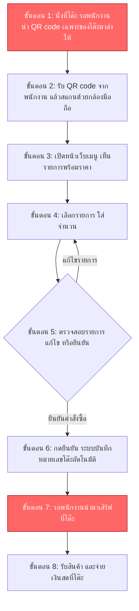
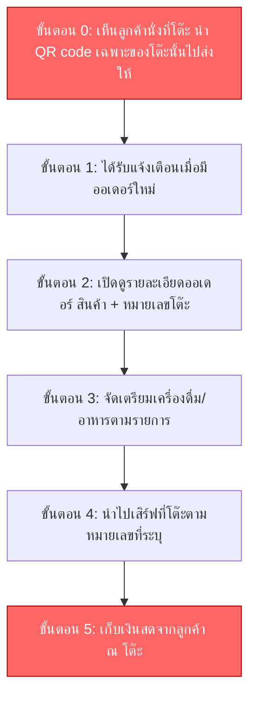

# User Journey: ระบบสั่งกาแฟด้วยตนเองจากโต๊ะ (Table Self-Order System)

> สร้างเมื่อ 2026-08-15
> อ้างอิงจาก [[../../01-requirements/01-spec/20260802-01-cafe-table-self-order|ระบบสั่งกาแฟด้วยตนเองจากโต๊ะ (Table Self-Order System)]] และ [[../../01-requirements/02-plan/20260815-01-cafe-table-self-order-feature-list|Feature List: ระบบสั่งกาแฟด้วยตนเองจากโต๊ะ (Table Self-Order System)]]

## Persona: ลูกค้า (Customer)

**เป้าหมาย:** สั่งเครื่องดื่ม/ของทานเล่นจากโต๊ะได้เองโดยไม่ต้องรอพนักงาน

### รายละเอียดแต่ละขั้นตอน

| ขั้นตอน | สิ่งที่ผู้ใช้ทำ | Touchpoint | ฟีเจอร์ที่เกี่ยวข้อง | Pain point (ถ้ามี) |
|---|---|---|---|---|
| C1 | นั่งที่โต๊ะ รอพนักงานเดินมาส่ง QR code เฉพาะของโต๊ะนั้น | พนักงาน (ส่ง QR code ที่โต๊ะ) | #1 สแกน QR code เพื่อเปิดหน้าเว็บสั่งอาหาร | ลูกค้าต้องรอพนักงานว่างมาส่ง QR code ก่อนจึงจะเริ่มสั่งได้ ต่างจาก QR sticker ที่สั่งได้ทันทีที่นั่งลง จึงอาจไม่ได้ลดภาระพนักงาน/คิวรอได้เต็มที่ตามเป้าหมายเดิมของระบบ |
| C2 | รับ QR code จากพนักงาน แล้วสแกนด้วยกล้องมือถือของตัวเอง | กล้องมือถือลูกค้า | #1 สแกน QR code เพื่อเปิดหน้าเว็บสั่งอาหาร | |
| C3 | เปิดหน้าเว็บเมนู เห็นเครื่องดื่ม/ของทานเล่นพร้อมราคา | หน้าเว็บสั่งอาหาร | #2 แสดงเมนูเครื่องดื่มและของทานเล่น/เบเกอรี่ พร้อมราคา | |
| C4 | เลือกรายการที่ต้องการ ใส่จำนวน | หน้าเว็บสั่งอาหาร | #3 เลือกรายการ ใส่จำนวน และยืนยันคำสั่งซื้อผ่านหน้าเว็บ | |
| C5 | ตรวจสอบรายการที่เลือก แล้วเลือกย้อนกลับไปแก้ไข หรือดำเนินการยืนยัน | หน้าเว็บสั่งอาหาร | #3 เลือกรายการ ใส่จำนวน และยืนยันคำสั่งซื้อผ่านหน้าเว็บ | |
| C6 | กดยืนยันคำสั่งซื้อ ระบบบันทึกหมายเลขโต๊ะอัตโนมัติจาก QR code | หน้าเว็บสั่งอาหาร | #3 เลือกรายการ ใส่จำนวน และยืนยันคำสั่งซื้อผ่านหน้าเว็บ, #4 ระบุหมายเลขโต๊ะอัตโนมัติจาก QR code | |
| C7 | รอพนักงานนำเครื่องดื่ม/อาหารมาเสิร์ฟที่โต๊ะ | โต๊ะ (รอสินค้า) | | ลูกค้าไม่มีวิธีติดตามสถานะออเดอร์ว่ากำลังทำหรือใกล้เสร็จ เพราะ spec ไม่ได้ระบุการแสดงสถานะออเดอร์ให้ลูกค้าเห็น |
| C8 | รับสินค้า และจ่ายเงินสดให้พนักงานที่โต๊ะ | โต๊ะ (จุดชำระเงิน) | #6 พนักงานนำไปเสิร์ฟที่โต๊ะพร้อมเก็บเงินสดจากลูกค้า ณ โต๊ะ | |

## Persona: พนักงาน (Staff)

**เป้าหมาย:** รับรู้ออเดอร์ใหม่ทันที จัดเตรียม/เสิร์ฟให้ถูกโต๊ะ และเก็บเงินครบถ้วน

### รายละเอียดแต่ละขั้นตอน

| ขั้นตอน | สิ่งที่ผู้ใช้ทำ | Touchpoint | ฟีเจอร์ที่เกี่ยวข้อง | Pain point (ถ้ามี) |
|---|---|---|---|---|
| S0 | สังเกตเห็นลูกค้านั่งที่โต๊ะ แล้วนำ QR code เฉพาะของโต๊ะนั้นไปส่งให้ลูกค้า | โต๊ะลูกค้า | #1 สแกน QR code เพื่อเปิดหน้าเว็บสั่งอาหาร | เป็นภาระงานเพิ่มของพนักงานที่ต้องคอยสังเกตโต๊ะว่างและเดินไปส่ง QR code เอง แทนที่ลูกค้าจะเริ่มสั่งได้เองทันทีจาก QR sticker ที่ติดโต๊ะไว้ล่วงหน้า |
| S1 | ได้รับการแจ้งเตือนเมื่อมีออเดอร์ใหม่เข้ามา | จอ/อุปกรณ์แจ้งเตือนของพนักงาน | #5 แจ้งเตือนพนักงาน/ครัวเมื่อมีออเดอร์ใหม่เข้ามา | |
| S2 | เปิดดูรายละเอียดออเดอร์ (รายการสินค้า + หมายเลขโต๊ะ) | หน้าจอออเดอร์ของพนักงาน | #4 ระบุหมายเลขโต๊ะอัตโนมัติจาก QR code, #5 แจ้งเตือนพนักงาน/ครัวเมื่อมีออเดอร์ใหม่เข้ามา | |
| S3 | จัดเตรียมเครื่องดื่ม/อาหารตามรายการ | ครัว/บาร์ | | |
| S4 | นำไปเสิร์ฟที่โต๊ะตามหมายเลขที่ระบบระบุ | โต๊ะลูกค้า | #4 ระบุหมายเลขโต๊ะอัตโนมัติจาก QR code, #6 พนักงานนำไปเสิร์ฟที่โต๊ะพร้อมเก็บเงินสดจากลูกค้า ณ โต๊ะ | |
| S5 | เก็บเงินสดจากลูกค้า ณ โต๊ะ | โต๊ะลูกค้า | #6 พนักงานนำไปเสิร์ฟที่โต๊ะพร้อมเก็บเงินสดจากลูกค้า ณ โต๊ะ | ไม่มีระบบช่วยคำนวณ/ยืนยันยอดเงินที่ต้องเก็บ พนักงานต้องคำนวณยอดเองเนื่องจาก spec ระบุว่าไม่มี online payment ในเวอร์ชันนี้ |

## เอกสารที่เกี่ยวข้อง

- [[../../01-requirements/01-spec/20260802-01-cafe-table-self-order|ระบบสั่งกาแฟด้วยตนเองจากโต๊ะ (Table Self-Order System)]]
- [[../../01-requirements/02-plan/20260815-01-cafe-table-self-order-feature-list|Feature List: ระบบสั่งกาแฟด้วยตนเองจากโต๊ะ (Table Self-Order System)]]
- [[cafe-table-self-order/index|Prototype: ระบบสั่งกาแฟด้วยตนเองจากโต๊ะ (ฝั่งลูกค้า)]]
