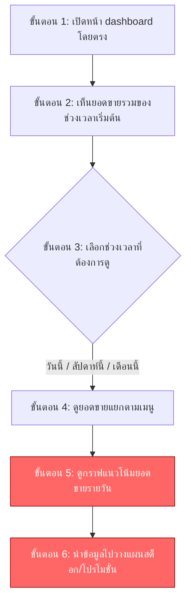

# User Journey: หน้า Dashboard ดูยอดขาย (Sales Dashboard)

> สร้างเมื่อ 2026-08-15
> อ้างอิงจาก [[../../01-requirements/01-spec/20260802-02-sales-dashboard|หน้า Dashboard ดูยอดขาย (Sales Dashboard)]] และ [[../../01-requirements/02-plan/20260815-02-sales-dashboard-feature-list|Feature List: หน้า Dashboard ดูยอดขาย (Sales Dashboard)]]

## Persona: เจ้าของร้าน/ผู้จัดการ (Owner/Manager)

**เป้าหมาย:** ติดตามผลประกอบการร้านและวางแผนสต็อก/โปรโมชั่นจากข้อมูลยอดขาย โดยไม่ต้องนับยอดด้วยมือ

### รายละเอียดแต่ละขั้นตอน

| ขั้นตอน | สิ่งที่ผู้ใช้ทำ | Touchpoint | ฟีเจอร์ที่เกี่ยวข้อง | Pain point (ถ้ามี) |
|---|---|---|---|---|
| D1 | เปิดหน้า dashboard โดยตรง (ไม่ต้อง login ในเวอร์ชันนี้) | หน้าเว็บ dashboard | | |
| D2 | เห็นยอดขายรวมของช่วงเวลาเริ่มต้น (default) | หน้า dashboard | #1 ยอดขายรวม (ตัวเลขสรุป) ตามช่วงเวลาที่เลือก | |
| D3 | เลือกช่วงเวลาที่ต้องการดู: วันนี้ / สัปดาห์นี้ / เดือนนี้ | ตัวเลือกช่วงเวลาบนหน้า dashboard | #2 ตัวเลือกช่วงเวลาแบบ preset (วันนี้/สัปดาห์นี้/เดือนนี้) | |
| D4 | ดูยอดขายแยกตามเมนูเพื่อดูว่าเมนูไหนขายดี | ตาราง/รายการยอดขายแยกเมนู | #3 ยอดขายแยกตามเมนู | |
| D5 | ดูกราฟแนวโน้มยอดขายรายวันของช่วงเวลาที่เลือก | กราฟแนวโน้ม | #4 กราฟแนวโน้มยอดขายรายวันในช่วงเวลาที่เลือก | ตัวเลขที่เห็นเป็น "ยอดออเดอร์" ไม่ใช่ยอดเงินสดที่กระทบยอดแล้ว ผู้จัดการอาจเข้าใจผิดว่าเป็นยอดเงินจริงหากหน้าจอไม่มีคำอธิบายข้อจำกัดนี้ชัดเจน (ต้องระบุไว้บนหน้าจอตาม business rule) |
| D6 | นำข้อมูลไปวางแผนสต็อกวัตถุดิบ/โปรโมชั่น | นอกระบบ (การตัดสินใจทางธุรกิจ) | | หน้า dashboard ไม่มีระบบ login/สิทธิ์การเข้าถึง ทำให้ใครก็เข้าดูข้อมูลยอดขายของร้านได้หากรู้ URL (ระบุไว้ใน spec ว่าเป็นประเด็นที่ต้องพิจารณาเพิ่มเติมในอนาคต) |

## เอกสารที่เกี่ยวข้อง

- [[../../01-requirements/01-spec/20260802-02-sales-dashboard|หน้า Dashboard ดูยอดขาย (Sales Dashboard)]]
- [[../../01-requirements/01-spec/20260802-01-cafe-table-self-order|ระบบสั่งกาแฟจากโต๊ะ (QR code)]] — แหล่งข้อมูลออเดอร์ที่ dashboard นี้นำมาคำนวณยอดขาย
- [[../../01-requirements/02-plan/20260815-02-sales-dashboard-feature-list|Feature List: หน้า Dashboard ดูยอดขาย (Sales Dashboard)]]
