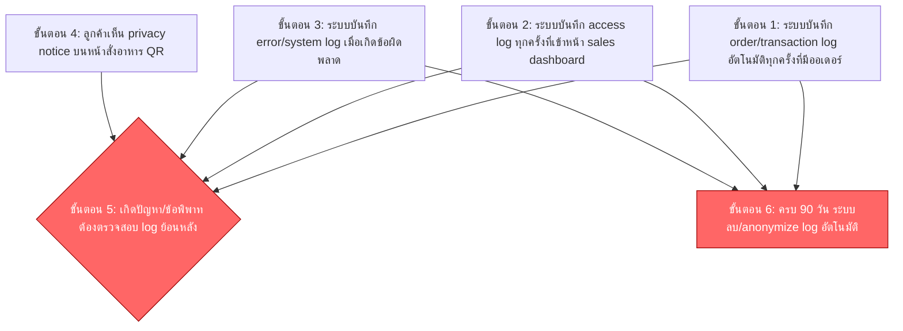

# User Journey: บันทึก Log และการปฏิบัติตาม PDPA เบื้องต้น (Logging & Basic PDPA Compliance)

> สร้างเมื่อ 2026-08-15
> อ้างอิงจาก [[../../01-requirements/01-spec/20260802-03-logging-pdpa-compliance|บันทึก Log และการปฏิบัติตาม PDPA เบื้องต้น (Logging & Basic PDPA Compliance)]] และ [[../../01-requirements/02-plan/20260815-03-logging-pdpa-compliance-feature-list|Feature List: บันทึก Log และการปฏิบัติตาม PDPA เบื้องต้น (Logging & Basic PDPA Compliance)]]

## Persona: เจ้าของร้าน (Owner)

**เป้าหมาย:** ตรวจสอบย้อนหลังได้เมื่อเกิดปัญหา/ข้อพิพาท และมั่นใจว่าร้านปฏิบัติตาม PDPA ในระดับพื้นฐาน โดยไม่ต้องสร้างระบบ consent management ที่ซับซ้อน (privacy notice ที่ลูกค้าเห็นถือเป็นเพียง touchpoint ของระบบ ไม่ใช่ journey แยกของลูกค้า)

### รายละเอียดแต่ละขั้นตอน

| ขั้นตอน | สิ่งที่ผู้ใช้ทำ | Touchpoint | ฟีเจอร์ที่เกี่ยวข้อง | Pain point (ถ้ามี) |
|---|---|---|---|---|
| L1 | ระบบบันทึก order/transaction log อัตโนมัติทุกครั้งที่มีออเดอร์เข้ามา (ทำงานเบื้องหลัง เจ้าของร้านไม่ต้องทำอะไร) | ระบบสั่งอาหาร QR (เบื้องหลัง) | #1 Order/transaction log | |
| L2 | ระบบบันทึก access log ทุกครั้งที่มีการเข้าหน้า sales dashboard | sales dashboard (เบื้องหลัง) | #2 Access log | |
| L3 | ระบบบันทึก error/system log เมื่อเกิดข้อผิดพลาดในระบบ | ระบบ (เบื้องหลัง) | #3 Error/system log | |
| L4 | ลูกค้าเห็นข้อความ privacy notice บนหน้าสั่งอาหาร QR ก่อนเริ่มสั่ง (แสดงให้เห็นเฉยๆ ไม่ต้องกดยอมรับ) | หน้าสั่งอาหาร QR | #5 Privacy notice แบบข้อความแจ้งเตือนเฉยๆ บนหน้าสั่งอาหาร QR | |
| L5 | เมื่อเกิดปัญหา/ข้อพิพาท เจ้าของร้านต้องตรวจสอบ log ย้อนหลัง | ที่จัดเก็บ log ของระบบ | #1, #2, #3 | spec ยังไม่ได้ระบุ UI/เครื่องมือสำหรับเจ้าของร้านในการค้นหา/ดู log จริง อาจต้องเข้าถึง raw log file หรือ database โดยตรง ซึ่งไม่สะดวกสำหรับผู้ที่ไม่ใช่สาย technical |
| L6 | เมื่อครบ 90 วัน ระบบลบ/anonymize log อัตโนมัติ (ทำงานเบื้องหลัง) | ระบบ (เบื้องหลัง) | #4 นโยบายเก็บรักษา log 90 วัน | ไม่มีการแจ้งเตือนเจ้าของร้านก่อนลบ log หากเจ้าของร้านลืมตรวจสอบข้อมูลสำคัญก่อนหมดอายุ อาจเสียหลักฐานที่จำเป็นสำหรับข้อพิพาทที่เพิ่งเกิดใกล้ช่วง 90 วัน |

## เอกสารที่เกี่ยวข้อง

- [[../../01-requirements/01-spec/20260802-03-logging-pdpa-compliance|บันทึก Log และการปฏิบัติตาม PDPA เบื้องต้น (Logging & Basic PDPA Compliance)]]
- [[../../01-requirements/01-spec/20260802-01-cafe-table-self-order|ระบบสั่งกาแฟจากโต๊ะ (QR code)]] — แหล่งกำเนิดของ order/transaction log และหน้าที่แสดง privacy notice
- [[../../01-requirements/01-spec/20260802-02-sales-dashboard|หน้า Dashboard ดูยอดขาย (Sales Dashboard)]] — เป้าหมายของ access log
- [[../../01-requirements/02-plan/20260815-03-logging-pdpa-compliance-feature-list|Feature List: บันทึก Log และการปฏิบัติตาม PDPA เบื้องต้น (Logging & Basic PDPA Compliance)]]
